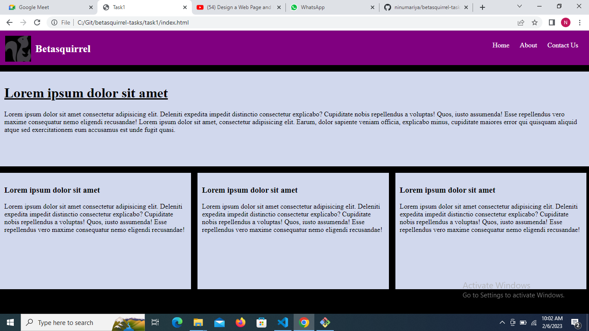
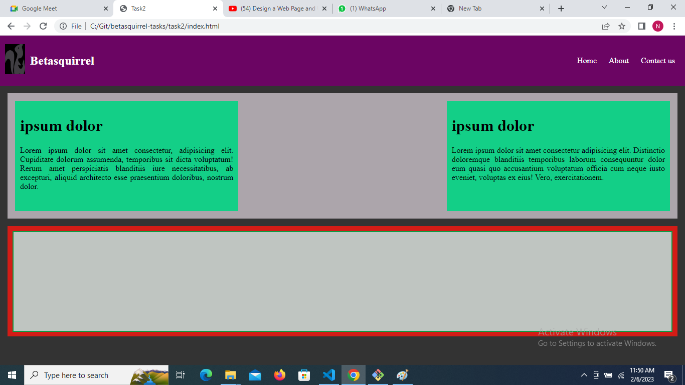
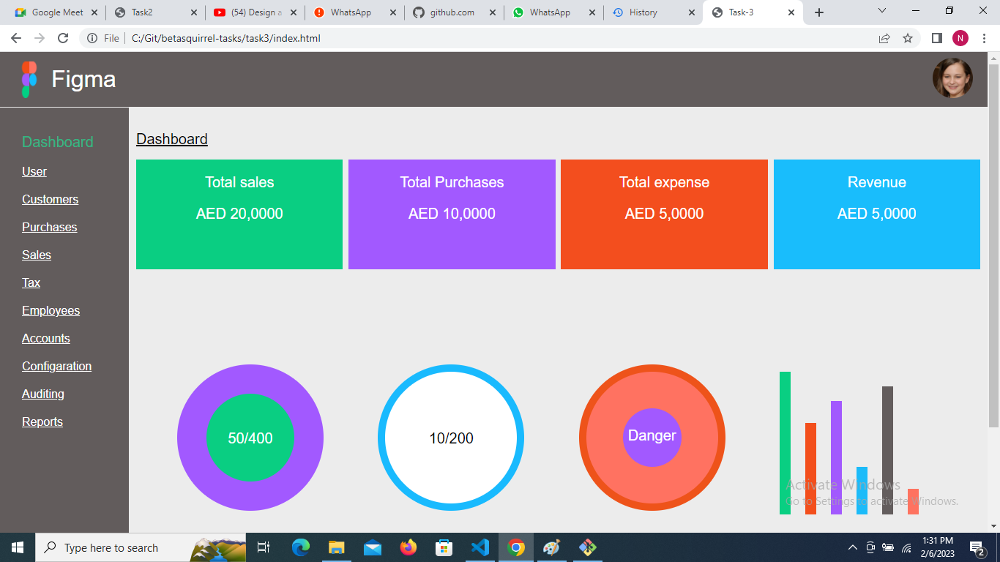

# Betasquirrel Tasks

Assignments from betasquirrel

website link

https://github.com/ninumariya/betasquirrel-tasks

## Requirements and output

| Requirements                                          | Output                                     |
| ----------------------------------------------------- | ------------------------------------------ |
|  |  |
|   |  |
|   |  |

## W3Schools learning tasks

1. [Attributes](https://www.w3schools.com/html/html_attributes.asp)
2. [Heading](https://www.w3schools.com/html/html_headings.asp)
3. [Paragraph](https://www.w3schools.com/html/html_paragraphs.asp)
4. [Styles](https://www.w3schools.com/html/html_styles.asp)
5. [Formatting](https://www.w3schools.com/html/html_formatting.asp)
6. [Quatation](https://www.w3schools.com/html/html_quotation_elements.asp)
7. [Comments](https://www.w3schools.com/html/html_comments.asp)
8. [Colors](https://www.w3schools.com/html/html_colors.asp)
9. [Css](https://www.w3schools.com/html/html_css.asp)
10. [Links](https://www.w3schools.com/html/html_links.asp)
11. [Images](https://www.w3schools.com/html/html_images.asp)
12. [Classes](https://www.w3schools.com/html/html_classes.asp)
13. [Id](https://www.w3schools.com/html/html_id.asp)
14. [Favicon](https://www.w3schools.com/html/html_favicon.asp)
15. [Tables](https://www.w3schools.com/html/html_tables.asp)

## Linux commands

- `cd` - change current directory. Ex: `cd desktop`, `cd ..`
- `ls` - List contents of a directory, Ex: `ls -a` lists hidden files as well.
- `pwd` - Display current working directory path
- `cat` - Display contents of a file Ex: `cat README.md`

## Git commands

1. `git config` Config git user. EX: `git config --global user.name "ninumariya", git config user.email "ninusijo1825@gmail.com"`
2. `git clone` clone a remote git repositery to your local. Ex: `git clone "add user https link or ssh key"`
3. `git add` Add your file changes to git. Ex: `git add . `: this will add all file to the repo git ,
   `add README.md` : this will add the readme file we can specify using the file name
4. `git commit` commit changes to git.Ex: `git commit -m "Initial commit"`
5. `git push` push your local commits to remote repo Ex: `git push origin main`

## Completed tasks

- task-1 completed
- task-2 completed
